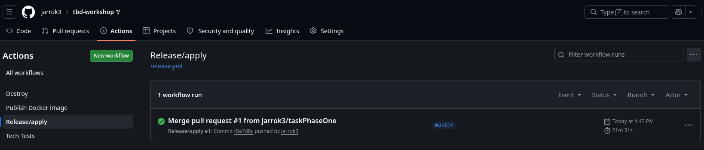
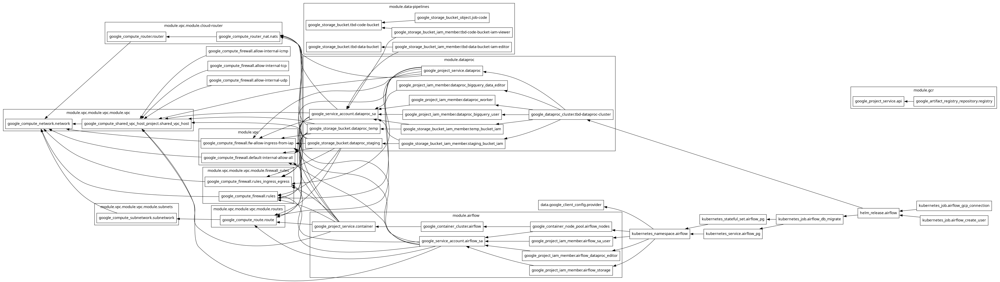
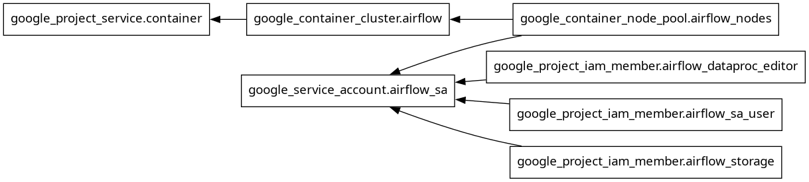
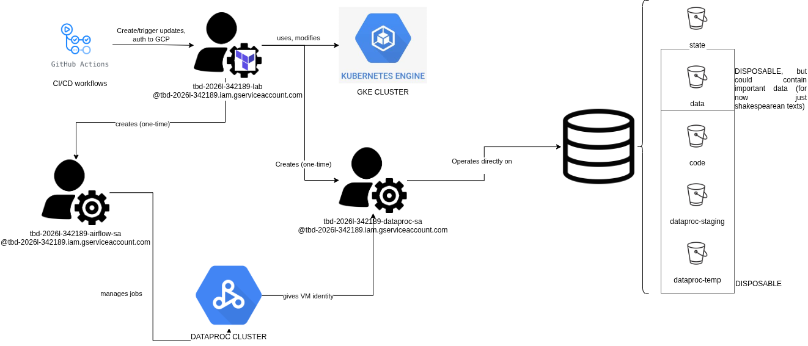

IMPORTANT ❗ ❗ ❗ Please remember to destroy all the resources after each work session. You can recreate infrastructure by creating new PR and merging it to master.


                                                                                                                                                                                                                                                                                                                                                                                  
## Phase 1 Exercise Overview

  ```mermaid
  flowchart TD
      A[🔧 Step 0: Fork repository] --> B[🔧 Step 1: Environment variables\nexport TF_VAR_*]
      B --> C[🔧 Step 2: Bootstrap\nterraform init/apply\n→ GCP project + state bucket]
      C --> D[🔧 Step 3: Quota increase\nCPUS_ALL_REGIONS ≥ 24]
      D --> E[🔧 Step 4: CI/CD Bootstrap\nWorkload Identity Federation\n→ keyless auth GH→GCP]
      E --> F[🔧 Step 5: GitHub Secrets\nGCP_WORKLOAD_IDENTITY_*\nINFRACOST_API_KEY]
      F --> G[🔧 Step 6: pre-commit install]
      G --> H[🔧 Step 7: Push + PR + Merge\n→ release workflow\n→ terraform apply]

      H --> I{Infrastructure\nrunning on GCP}

      I --> J[📋 Task 3: Destroy\nGitHub Actions → workflow_dispatch]
      I --> K[📋 Task 4: New branch\nModify tasks-phase1.md\nPR → merge → new release]
      I --> L[📋 Task 5: Analyze Terraform\nterraform plan/graph\nDescribe selected module]
      I --> M[📋 Task 6: YARN UI\ngcloud compute ssh\nIAP tunnel → port 8088]
      I --> N[📋 Task 7: Architecture diagram\nService accounts + buckets]
      I --> O[📋 Task 8: Infracost\nUsage profiles for\nartifact_registry + storage_bucket]
      I --> P[📋 Task 9: Spark job fix\nAirflow UI → DAG → debug\nFix spark-job.py]
      I --> Q[📋 Task 10: BigQuery\nDataset + external table\non ORC files]
      I --> R[📋 Task 11: Spot instances\npreemptible_worker_config\nin Dataproc module]
      I --> S[📋 Task 12: Auto-destroy\nNew GH Actions workflow\nschedule + cleanup tag]

      style A fill:#4a9eff,color:#fff
      style B fill:#4a9eff,color:#fff
      style C fill:#4a9eff,color:#fff
      style D fill:#ff9f43,color:#fff
      style E fill:#4a9eff,color:#fff
      style F fill:#ff9f43,color:#fff
      style G fill:#4a9eff,color:#fff
      style H fill:#4a9eff,color:#fff
      style I fill:#2ed573,color:#fff
      style J fill:#a55eea,color:#fff
      style K fill:#a55eea,color:#fff
      style L fill:#a55eea,color:#fff
      style M fill:#a55eea,color:#fff
      style N fill:#a55eea,color:#fff
      style O fill:#a55eea,color:#fff
      style P fill:#a55eea,color:#fff
      style Q fill:#a55eea,color:#fff
      style R fill:#a55eea,color:#fff
      style S fill:#a55eea,color:#fff
```

  Legend

  - 🔵 Blue — setup steps (one-time configuration)
  - 🟠 Orange — manual steps (GCP Console / GitHub UI)
  - 🟢 Green — infrastructure ready
  - 🟣 Purple — tasks to complete and document in tasks-phase1.md

1. Authors:

   ***enter your group nr***

   ***link to forked repo***

2. Follow all steps in README.md.

3. From available Github Actions select and run destroy on master branch.

4. Create new git branch and:
    1. Modify tasks-phase1.md file.

    2. Create PR from this branch to **YOUR** master and merge it to make new release.

*Fig. 1. Initial release building the cloud infrastructure* 



5. Analyze terraform code. Play with terraform plan, terraform graph to investigate different modules.

*Fig. 2. Graph of the overall system architecture*



*Fig. 3. Graph of one of the submodules - airflow*


**Analizowany moduł: Airflow**

Moduł Airflow odpowiada za utworzenie i konfigurację środowiska orkiestracji procesów danych w oparciu o platformę Google Cloud. Na podstawie analizy zależności zasobów w Terraformie można stwierdzić, że środowisko to zostało zaimplementowane z wykorzystaniem klastra Kubernetes zarządzanego przez usługę Google Kubernetes Engine (GKE).

W pierwszej kolejności moduł aktywuje wymagane API projektu, w szczególności usługę odpowiedzialną za obsługę kontenerów. Następnie tworzony jest klaster Kubernetes (google_container_cluster.airflow), który stanowi podstawową warstwę obliczeniową dla działania komponentów Airflow. W ramach klastra definiowana jest pula węzłów (google_container_node_pool.airflow_nodes), czyli zestaw maszyn wirtualnych odpowiedzialnych za wykonywanie zadań.
Istotnym elementem modułu jest utworzenie dedykowanego konta serwisowego (google_service_account.airflow_sa), które wykorzystywane jest przez środowisko Airflow do komunikacji z innymi usługami Google Cloud. Konto to otrzymuje odpowiednie role IAM, umożliwiające realizację zadań związanych z przetwarzaniem danych oraz integracją z infrastrukturą chmurową. W szczególności przypisywane są role pozwalające na zarządzanie zadaniami w usłudze Dataproc (dataproc.editor), korzystanie z innych kont serwisowych (serviceAccountUser) oraz dostęp do zasobów pamięci masowej w Cloud Storage.

Zależności pomiędzy zasobami wskazują, że klaster Kubernetes tworzony jest po aktywacji odpowiednich usług, a pula węzłów jest bezpośrednio powiązana z klastrem. Konto serwisowe wraz z przypisanymi rolami stanowi natomiast element wspólny, wykorzystywany przez komponenty uruchamiane w klastrze.

W rezultacie moduł tworzy kompletne środowisko umożliwiające uruchamianie i zarządzanie przepływami pracy (DAG-ami) w Airflow. Dzięki integracji z usługami takimi jak Dataproc oraz Cloud Storage możliwe jest budowanie złożonych potoków przetwarzania danych, obejmujących zarówno orkiestrację zadań, jak i operacje na dużych zbiorach danych.

6. Reach YARN UI

   ***place the command you used for setting up the tunnel, the port and the screenshot of YARN UI here***

   Hint: the Dataproc cluster has `internal_ip_only = true`, so you need to use an IAP tunnel.
   See: `gcloud compute ssh` with `-- -L <local_port>:localhost:<remote_port>` and `--tunnel-through-iap` flag.
   YARN ResourceManager UI runs on port **8088**.

7. Draw an architecture diagram (e.g. in draw.io) that includes:
    1. Description of the components of service accounts
    2. List of buckets for disposal




- tbd-2026l-342189-lab@tbd-2026l-342189.iam.gserviceaccount.com -> terraform sa (service account) with owner rights for resources management through IaC
- tbd-2026l-342189-dataproc-sa@tbd-2026l-342189.iam.gserviceaccount.com -> for batch processing and data access; roles: dataproc.worker, bigquery.Editor, bigquery.user
- tbd-2026l-342189-airflow-sa@tbd-2026l-342189.iam.gserviceaccount.com -> airflow sa used for dataflows; roles: dataproc.editor, iam.serviceAccountUser, storage.objectViewer
- 687082916393-compute@developer.gserviceaccount.com -> compute engine sa, automatically created for computing


8. Create a new PR and add costs by entering the expected consumption into Infracost
For all the resources of type: `google_artifact_registry_repository`, `google_storage_bucket`
create a sample usage profiles and add it to the Infracost task in CI/CD pipeline. Usage file [example](https://github.com/infracost/infracost/blob/master/infracost-usage-example.yml)

   ***place the expected consumption you entered here***

   ***place the screenshot from infracost output here***

9. Find and correct the error in spark-job.py

    After `terraform apply` completes, connect to the Airflow cluster:
    ```bash
    gcloud container clusters get-credentials airflow-cluster --zone europe-west1-b --project PROJECT_NAME
    ```
    
    Then check the external IP (AIRFLOW_EXTERNAL_IP) of the webserver service:
    kubectl get svc -n airflow airflow-webserver                                                                                                                                                                 
                                              
                                                                                                                                                                                                               
    ▎ Note: If EXTERNAL-IP shows <pending>, wait a moment and retry — LoadBalancer IP allocation may take 1-2 minutes.  

    DAG files are synced automatically from your GitHub repo via git-sync sidecar.
    Airflow variables and the `google_cloud_default` GCP connection are also configured by Terraform.

    a) In the Airflow UI (http://AIRFLOW_EXTERNAL_IP:8080, login: admin/admin), find the `dataproc_job` DAG, unpause it and trigger it manually.

    ***place a screenshot of the DAG in the Airflow UI***

    b) The DAG will fail. Examine the task logs in the Airflow UI to find the root cause.

    ***paste the relevant error message from the Airflow task log***

    ***describe what the error is and how you found it***

    c) Fix the error in `modules/data-pipeline/resources/spark-job.py` and re-upload the file to GCS:
    ```bash
    gsutil cp modules/data-pipeline/resources/spark-job.py gs://PROJECT_NAME-code/spark-job.py
    ```
    Then trigger the DAG again from the Airflow UI.

    ***paste the link to the fixed file***

    d) Verify the DAG completes successfully and check that ORC files were written to the data bucket:
    ```bash
    gsutil ls gs://PROJECT_NAME-data/data/shakespeare/
    ```

    ***place a screenshot of the successful DAG run in Airflow UI***

11. Create a BigQuery dataset and an external table using SQL

    Using the ORC data produced by the Spark job in task 9, create a BigQuery dataset and an external table.

    Note: the dataset must be created in the same region as the GCS bucket (`europe-west1`), e.g.:
    ```bash
    bq mk --dataset --location=europe-west1 shakespeare
    ```

    ***place the SQL code and query output here***

    ***why does ORC not require a table schema?***

12. Add support for preemptible/spot instances in a Dataproc cluster

    ***place the link to the modified file and inserted terraform code***

13. Triggered Terraform Destroy on Schedule or After PR Merge. Goal: make sure we never forget to clean up resources and burn money.

Add a new GitHub Actions workflow that:
  1. runs terraform destroy -auto-approve
  2. triggers automatically:

   a) on a fixed schedule (e.g. every day at 20:00 UTC)

   b) when a PR is merged to master containing [CLEANUP] tag in title

Steps:
  1. Create file .github/workflows/auto-destroy.yml
  2. Configure it to authenticate and destroy Terraform resources
  3. Test the trigger (schedule or cleanup-tagged PR)

Hint: use the existing `.github/workflows/destroy.yml` as a starting point.

***paste workflow YAML here***

***paste screenshot/log snippet confirming the auto-destroy ran***

***write one sentence why scheduling cleanup helps in this workshop***
