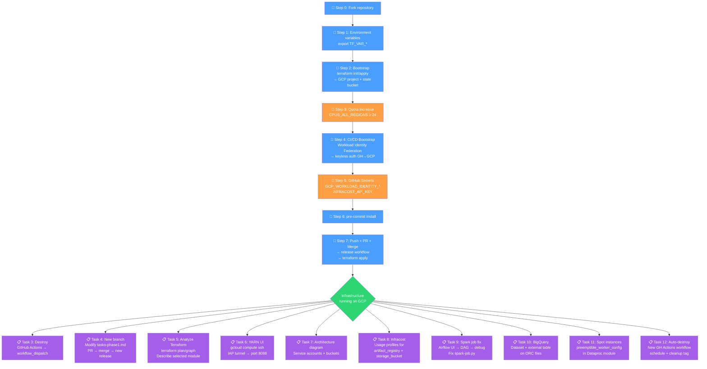
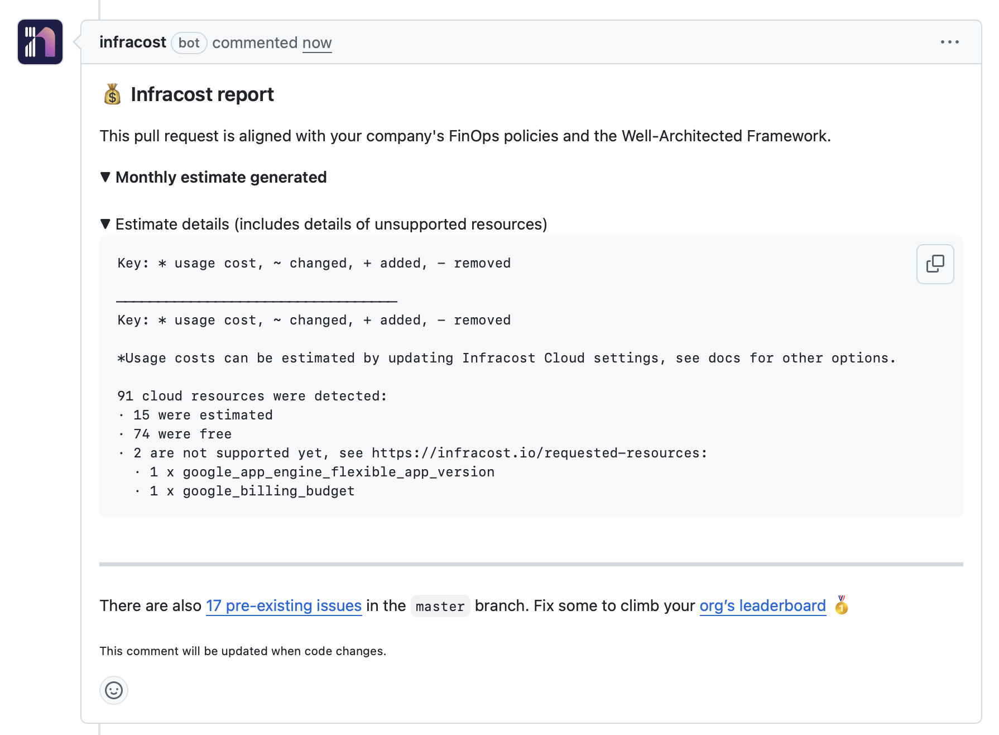
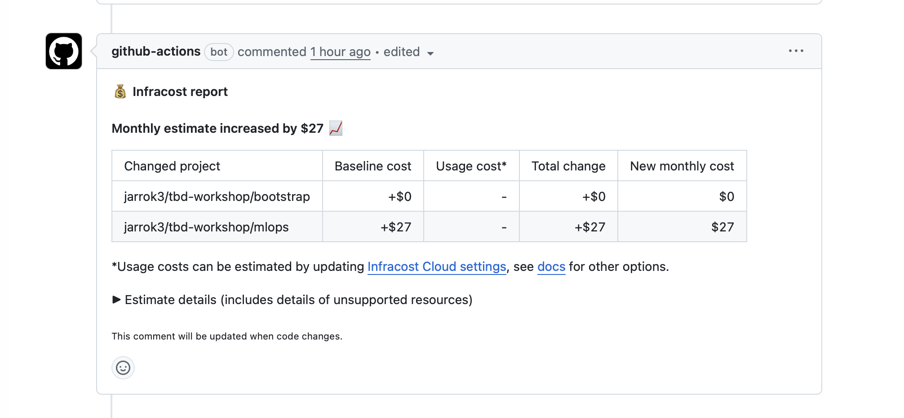
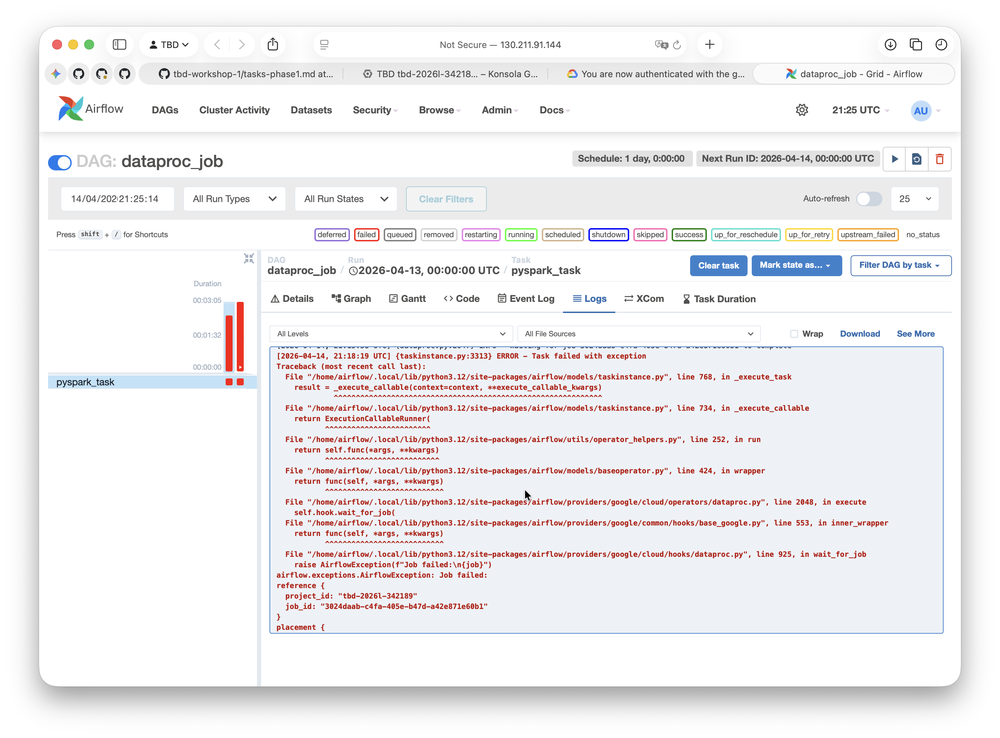
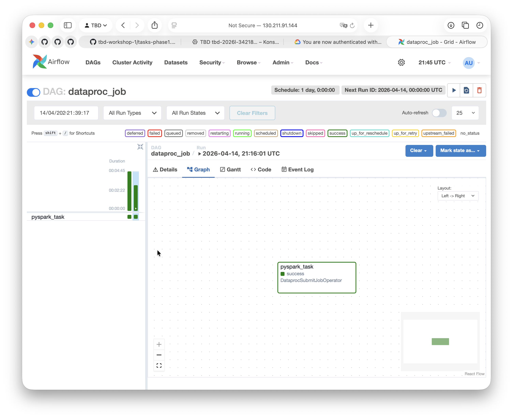
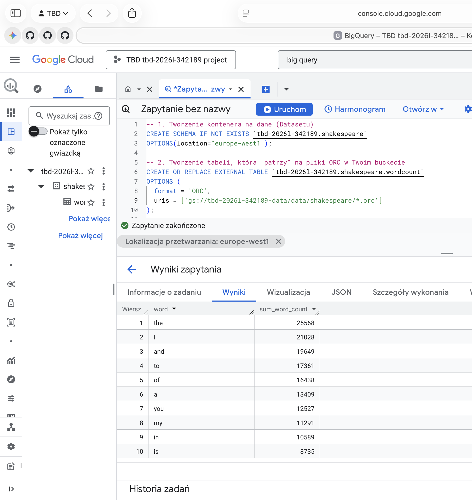

IMPORTANT ❗ ❗ ❗ Please remember to destroy all the resources after each work session. You can recreate infrastructure by creating new PR and merging it to master.


## Phase 1 Exercise Overview



Legend

- 🔵 Blue — setup steps (one-time configuration)
- 🟠 Orange — manual steps (GCP Console / GitHub UI)
- 🟢 Green — infrastructure ready
- 🟣 Purple — tasks to complete and document in tasks-phase1.md

1. Authors:

   Grupa nr.10

   [repo](https://github.com/jarrok3/tbd-workshop)

2. Follow all steps in README.md.

3. From available Github Actions select and run destroy on master branch.

4. Create new git branch and:
   1. Modify tasks-phase1.md file.

   2. Create PR from this branch to **YOUR** master and merge it to make new release.

_Fig. 1. Initial release building the cloud infrastructure_


5. Analyze terraform code. Play with terraform plan, terraform graph to investigate different modules.

_Fig. 2. Graph of the overall system architecture_


_Fig. 3. Graph of one of the submodules - airflow_


**Analizowany moduł: Airflow**

Moduł Airflow odpowiada za utworzenie i konfigurację środowiska orkiestracji procesów danych w oparciu o platformę Google Cloud. Na podstawie analizy zależności zasobów w Terraformie można stwierdzić, że środowisko to zostało zaimplementowane z wykorzystaniem klastra Kubernetes zarządzanego przez usługę Google Kubernetes Engine (GKE).

W pierwszej kolejności moduł aktywuje wymagane API projektu, w szczególności usługę odpowiedzialną za obsługę kontenerów. Następnie tworzony jest klaster Kubernetes (google_container_cluster.airflow), który stanowi podstawową warstwę obliczeniową dla działania komponentów Airflow. W ramach klastra definiowana jest pula węzłów (google_container_node_pool.airflow_nodes), czyli zestaw maszyn wirtualnych odpowiedzialnych za wykonywanie zadań.
Istotnym elementem modułu jest utworzenie dedykowanego konta serwisowego (google_service_account.airflow_sa), które wykorzystywane jest przez środowisko Airflow do komunikacji z innymi usługami Google Cloud. Konto to otrzymuje odpowiednie role IAM, umożliwiające realizację zadań związanych z przetwarzaniem danych oraz integracją z infrastrukturą chmurową. W szczególności przypisywane są role pozwalające na zarządzanie zadaniami w usłudze Dataproc (dataproc.editor), korzystanie z innych kont serwisowych (serviceAccountUser) oraz dostęp do zasobów pamięci masowej w Cloud Storage.

Zależności pomiędzy zasobami wskazują, że klaster Kubernetes tworzony jest po aktywacji odpowiednich usług, a pula węzłów jest bezpośrednio powiązana z klastrem. Konto serwisowe wraz z przypisanymi rolami stanowi natomiast element wspólny, wykorzystywany przez komponenty uruchamiane w klastrze.

W rezultacie moduł tworzy kompletne środowisko umożliwiające uruchamianie i zarządzanie przepływami pracy (DAG-ami) w Airflow. Dzięki integracji z usługami takimi jak Dataproc oraz Cloud Storage możliwe jest budowanie złożonych potoków przetwarzania danych, obejmujących zarówno orkiestrację zadań, jak i operacje na dużych zbiorach danych.

6. Reach YARN UI

   gcloud compute ssh tbd-cluster-m --zone=europe-west1-b --tunnel-through-iap -- -L 8088:localhost:8088


Aby zoabaczyc wynik należy wpisac w przeglądarkę:  
http://localhost:8088


Hint: the Dataproc cluster has `internal_ip_only = true`, so you need to use an IAP tunnel.
See: `gcloud compute ssh` with `-- -L <local_port>:localhost:<remote_port>` and `--tunnel-through-iap` flag.
YARN ResourceManager UI runs on port **8088**.

7. Draw an architecture diagram (e.g. in draw.io) that includes:
   1. Description of the components of service accounts
   2. List of buckets for disposal


- tbd-2026l-342189-lab@tbd-2026l-342189.iam.gserviceaccount.com -> terraform sa (service account) with owner rights for resources management through IaC
- tbd-2026l-342189-dataproc-sa@tbd-2026l-342189.iam.gserviceaccount.com -> for batch processing and data access; roles: dataproc.worker, bigquery.Editor, bigquery.user
- tbd-2026l-342189-airflow-sa@tbd-2026l-342189.iam.gserviceaccount.com -> airflow sa used for dataflows; roles: dataproc.editor, iam.serviceAccountUser, storage.objectViewer
- 687082916393-compute@developer.gserviceaccount.com -> compute engine sa, automatically created for computing

8.  Create a new PR and add costs by entering the expected consumption into Infracost
    For all the resources of type: `google_artifact_registry_repository`, `google_storage_bucket`
    create a sample usage profiles and add it to the Infracost task in CI/CD pipeline. Usage file [example](https://github.com/infracost/infracost/blob/master/infracost-usage-example.yml)

    Dla przykładowego zuzycia kosztów w chmurze załozymy większe wartosci zasobów, zeby przekroczyć darmowe limity chmur i zobaczyc prawdeziwą wycenę projektu. Założono przechowywanie obrazów o łącznej wadze 500 GB oraz miesięczny transfer danych na poziomie 50 GB. Przyjęto 500 GB przechowywanych danych typu Big Data (pliki tekstowe, format ORC). Liczba operacji klasy A (zapis) została oszacowana na 5,000, a klasy B (odczyt) na 10,000, biorąc pod uwagę częste uruchamianie zadań Spark i zapytań BigQuery. Dla mniejszych bucketów technicznych przyjęto wartości 10 GB.

    
    

9.  Find and correct the error in spark-job.py

        After `terraform apply` completes, connect to the Airflow cluster:
        ```bash
        gcloud container clusters get-credentials airflow-cluster --zone europe-west1-b --project PROJECT_NAME
        ```

        Then check the external IP (AIRFLOW_EXTERNAL_IP) of the webserver service:
        kubectl get svc -n airflow airflow-webserver


        ▎ Note: If EXTERNAL-IP shows <pending>, wait a moment and retry — LoadBalancer IP allocation may take 1-2 minutes.

        DAG files are synced automatically from your GitHub repo via git-sync sidecar.
        Airflow variables and the `google_cloud_default` GCP connection are also configured by Terraform.

        a) In the Airflow UI (http://AIRFLOW_EXTERNAL_IP:8080, login: admin/admin), find the `dataproc_job` DAG, unpause it and trigger it manually.

        

        b) The DAG will fail. Examine the task logs in the Airflow UI to find the root cause.

        [2026-04-14, 21:18:19 UTC] {taskinstance.py:3313} ERROR - Task failed with exceptionTraceback (most recent call last):  File "/home/airflow/.local/lib/python3.12/site-packages/airflow/models/taskinstance.py", line 768, in _execute_task    result = _execute_callable(context=context, **execute_callable_kwargs)             ^^^^^^^^^^^^^^^^^^^^^^^^^^^^^^^^^^^^^^^^^^^^^^^^^^^^^^^^^^^^^  File "/home/airflow/.local/lib/python3.12/site-packages/airflow/models/taskinstance.py", line 734, in _execute_callable    return ExecutionCallableRunner(           ^^^^^^^^^^^^^^^^^^^^^^^^  File "/home/airflow/.local/lib/python3.12/site-packages/airflow/utils/operator_helpers.py", line 252, in run    return self.func(*args, **kwargs)           ^^^^^^^^^^^^^^^^^^^^^^^^^^  File "/home/airflow/.local/lib/python3.12/site-packages/airflow/models/baseoperator.py", line 424, in wrapper    return func(self, *args, **kwargs)           ^^^^^^^^^^^^^^^^^^^^^^^^^^^  File "/home/airflow/.local/lib/python3.12/site-packages/airflow/providers/google/cloud/operators/dataproc.py", line 2048, in execute    self.hook.wait_for_job(  File "/home/airflow/.local/lib/python3.12/site-packages/airflow/providers/google/common/hooks/base_google.py", line 553, in inner_wrapper    return func(self, *args, **kwargs)           ^^^^^^^^^^^^^^^^^^^^^^^^^^^  File "/home/airflow/.local/lib/python3.12/site-packages/airflow/providers/google/cloud/hooks/dataproc.py", line 925, in wait_for_job    raise AirflowException(f"Job failed:\n{job}")airflow.exceptions.AirflowException: Job failed:reference {  project_id: "tbd-2026l-342189"  job_id: "3024daab-c4fa-405e-b47d-a42e871e60b1"}placement {  cluster_name: "tbd-cluster"  cluster_uuid: "c66a2c9e-0d13-4f24-a1a4-c712be762235"}pyspark_job {  main_python_file_uri: "gs://tbd-2026l-342189-code/spark-job.py"  properties {    key: "spark.executor.memory"    value: "2g"  }  properties {    key: "spark.executor.instances"    value: "2"  }  properties {    key: "spark.driver.memory"    value: "2g"  }}status {  state: ERROR  details: "Google Cloud Dataproc Agent reports job failure. If logs are available, they can be found at:\nhttps://console.cloud.google.com/dataproc/jobs/3024daab-c4fa-405e-b47d-a42e871e60b1?project=tbd-2026l-342189&region=europe-west1\ngcloud dataproc jobs wait \'3024daab-c4fa-405e-b47d-a42e871e60b1\' --region \'europe-west1\' --project \'tbd-2026l-342189\'\nhttps://console.cloud.google.com/storage/browser/tbd-2026l-342189-dataproc-staging/google-cloud-dataproc-metainfo/c66a2c9e-0d13-4f24-a1a4-c712be762235/jobs/3024daab-c4fa-405e-b47d-a42e871e60b1/\ngs://tbd-2026l-342189-dataproc-staging/google-cloud-dataproc-metainfo/c66a2c9e-0d13-4f24-a1a4-c712be762235/jobs/3024daab-c4fa-405e-b47d-a42e871e60b1/driveroutput.*"  state_start_time {    seconds: 1776201498    nanos: 631448000  }}status_history {  state: PENDING  state_start_time {    seconds: 1776201358    nanos: 227887000  }}status_history {  state: SETUP_DONE  state_start_time {    seconds: 1776201358    nanos: 349324000  }}status_history {  state: RUNNING  state_start_time {    seconds: 1776201358    nanos: 966106000  }}yarn_applications {  name: "Shakespeare WordCount"  state: FINISHED  progress: 1  tracking_url: "http://tbd-cluster-m.c.tbd-2026l-342189.internal.:8088/proxy/application_1776005412633_0001/"}driver_output_resource_uri: "gs://tbd-2026l-342189-dataproc-staging/google-cloud-dataproc-metainfo/c66a2c9e-0d13-4f24-a1a4-c712be762235/jobs/3024daab-c4fa-405e-b47d-a42e871e60b1/driveroutput"driver_control_files_uri: "gs://tbd-2026l-342189-dataproc-staging/google-cloud-dataproc-metainfo/c66a2c9e-0d13-4f24-a1a4-c712be762235/jobs/3024daab-c4fa-405e-b47d-a42e871e60b1/"job_uuid: "3024daab-c4fa-405e-b47d-a42e871e60b1"done: true
        [2026-04-14, 21:18:19 UTC] {taskinstance.py:1226} INFO - Marking task as FAILED. dag_id=dataproc_job, task_id=pyspark_task, run_id=scheduled\_\_2026-04-13T00:00:00+00:00, execution_date=20260413T000000, start_date=20260414T211556, end_date=20260414T211819
        [2026-04-14, 21:18:19 UTC] {taskinstance.py:341}

        Błąd to AirflowException, informujący o niepowodzeniu zadania Spark (Job failed) na klastrze Dataproc. Znalazłam go w logach zadania pyspark_task w interfejsie Airflow. Logi wskazują, że klaster Dataproc raportuje stan ERROR, jednak aby poznać dokładną przyczynę błędu wewnątrz kodu Python (np. błąd składni, brakujący plik lub błędna nazwa zmiennej), należy sprawdzić wyjście drivera Sparka pod adresem wskazanym w polu details lub bezpośrednio w konsoli Dataproc.

        c) Fix the error in `modules/data-pipeline/resources/spark-job.py` and re-upload the file to GCS:
        ```bash
        gsutil cp modules/data-pipeline/resources/spark-job.py gs://PROJECT_NAME-code/spark-job.py
        ```
        Then trigger the DAG again from the Airflow UI.

        [link to the file](https://github.com/jarrok3/tbd-workshop/blob/master/modules/data-pipeline/resources/spark-job.py)

        d) Verify the DAG completes successfully and check that ORC files were written to the data bucket:
        ```bash
        gsutil ls gs://PROJECT_NAME-data/data/shakespeare/
        ```

        

10. Create a BigQuery dataset and an external table using SQL

    Using the ORC data produced by the Spark job in task 9, create a BigQuery dataset and an external table.

    Note: the dataset must be created in the same region as the GCS bucket (`europe-west1`), e.g.:

    ```bash
    bq mk --dataset --location=europe-west1 shakespeare
    ```

    

    ORC jest formatem samopiszącym się. W przeciwieństwie do formatu CSV, gdzie dane to czysty tekst i musimy ręcznie definiować, która kolumna to liczba, a która to data, pliki ORC przechowują metadane bezpośrednio w swojej strukturze.

11. Add support for preemptible/spot instances in a Dataproc cluster

    **_place inserted terraform code_**

    Zmieniony plik:
    [tbd-workshop/modules/dataproc/main.tf at taskPhaseOne · jarrok3/tbd-workshop](https://github.com/jarrok3/tbd-workshop/blob/taskPhaseOne/modules/dataproc/main.tf)

Dodany kod: 
preemptible_worker_config {
      num_instances = 2
      disk_config {
        boot_disk_type    = "pd-standard"
        boot_disk_size_gb = 100
      }
    }

12. Triggered Terraform Destroy on Schedule or After PR Merge. Goal: make sure we never forget to clean up resources and burn money.

Add a new GitHub Actions workflow that:

1. runs terraform destroy -auto-approve
2. triggers automatically:

a) on a fixed schedule (e.g. every day at 20:00 UTC)

b) when a PR is merged to master containing [CLEANUP] tag in title

Steps:

1. Create file .github/workflows/auto-destroy.yml
2. Configure it to authenticate and destroy Terraform resources
3. Test the trigger (schedule or cleanup-tagged PR)

Hint: use the existing `.github/workflows/destroy.yml` as a starting point.

https://github.com/jarrok3/tbd-workshop/blob/master/.github/workflows/auto-destroy.yml


Regularne czyszczenie zasobów powoduje zmniejszenie kosztów. Zasoby generują kosztu tak długo jak istnieją.
